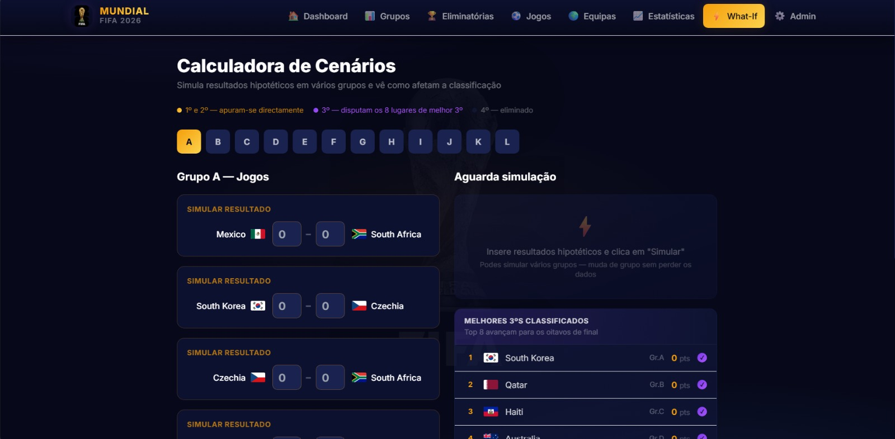
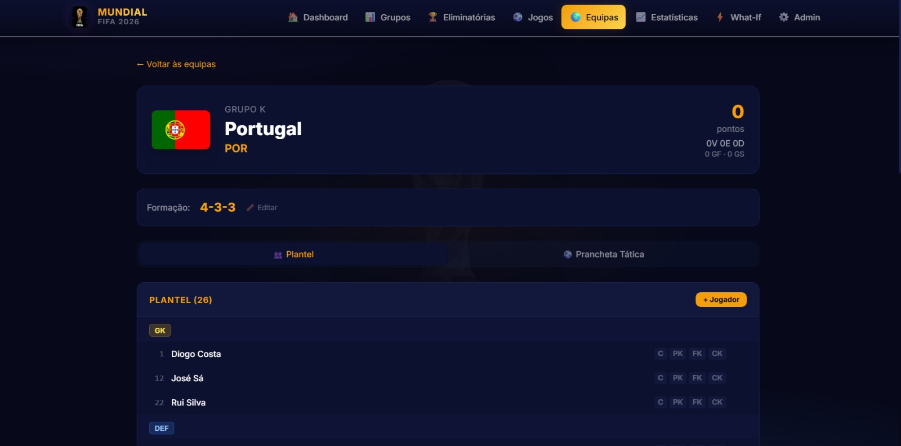
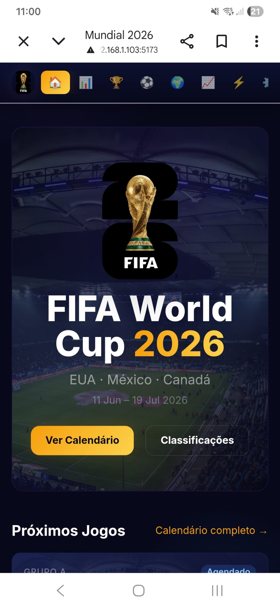

# ⚽ FIFA World Cup 2026 — Full-Stack Engineering Case Study

> **Plataforma High-Performance para Gestão, Acompanhamento em Tempo Real e Simulação de Cenários do Mundial FIFA 2026**

[](#-arquitetura-técnica)
[](#-tecnologias-e-stack)
[](#-tecnologias-e-stack)
[](#-arquitetura-técnica)

---

## 📌 Executive Overview & Proposta de Valor

O **Mundial 2026 Engine** é um sistema completo desenvolvido sob padrões corporativos de arquitetura de software para centralizar, gerir e simular o torneio da **FIFA World Cup 2026** (48 seleções, 12 grupos e fase a eliminar de 32 equipas).

Desenhada para operar com elevada autonomia em **ambiente local (on-premise / local execution)**, a plataforma resolve três grandes desafios de engenharia desportiva em tempo real:

1. **Simulação Determinística de Cenários ("What-If Simulator"):** Permite a re-simulação instantânea de qualquer partida, recalculando classificações de grupos, critérios de desempate e repescagem dos 8 melhores 3ºs classificados em sub-milisegundos.
2. **Sincronização & Normalização de Dados Externos:** Pipeline de ingestion de dados com resiliência, que recolhe dados em tempo real da **ESPN API** e feeds **RSS**, normalizando estruturas não estruturadas para um esquema relacional SQLite via **Drizzle ORM**.
3. **Interface Visual Responsiva High-Density (Glassmorphism UI):** Painel interativo com pranchetas táticas interativas (4-3-3, atribuição de batedores), árvore de eliminatórias dinâmica e notificações push instantâneas.

---

## 📸 Galeria de Demonstração (Demo Gallery)

| Simulador "What-If" | Prancheta Tática & Plantel | Dashboard & Responsividade Mobile |
| :---: | :---: | :---: |
|  |  |  |
| *Simulação interativa da fase de grupos e apuramento dos 8 melhores 3ºs* | *Formação tática visual e gestão de batedores de bolas paradas* | *UI responsiva otimizada com suporte PWA e visualização Mobile* |

---

## 🧠 Destaques de Engenharia & Algoritmos

### 1. Engine de Simulação de Cenários ("What-If")
A lógica de cálculo de tabelas e emparelhamento de fases eliminatórias é executada em memória através de algoritmos determinísticos em TypeScript:

* **Critérios Formais de Desempate FIFA:**
  1. Pontos totais.
  2. Diferença de golos (DG).
  3. Golos marcados (GF).
  4. Confronto direto entre equipas empatadas.
* **Cálculo dos 8 Melhores 3º Classificados (Fase de 48 Equipas):**
  * O algoritmo filtra e ordena os 12 terceiros classificados de todos os grupos com base nos critérios oficiais, projetando os confrontos da fase dos 1/16 de final instantaneamente ao alterar qualquer golo no simulador.

### 2. Pipeline de Ingestão de Dados & Sync Resiliente
O backend utiliza um sistema de background daemons com agendamento adaptativo em [`backend/src/services/espnSync.ts`](./backend/src/services/espnSync.ts) e [`backend/src/services/newsSync.ts`](./backend/src/services/newsSync.ts):

* **Ingestão Inteligente (Polling Adaptativo):** Durante partidas ativas (`Live`), o ciclo reduz o intervalo de sincronização para **30 segundos**, atualizando marcadores, marcadores de golos, cartões e substituições.
* **Normalização Relacional em SQLite:** Mapeamento de dados não padronizados oriundos da API da ESPN para estruturas estritas usando Drizzle ORM (`teams`, `players`, `matches`, `events`, `lineups`).
* **Resiliência a Erros:** Mecanismo de fallback que impede bloqueios do thread principal Express em caso de falha ou latência extrema nas APIs externas.

---

## 📐 Arquitetura Técnica do Sistema

```text
┌─────────────────────────────────────────────────────────────────────────────┐
│                            FRONTEND (React 18 + Vite)                       │
│  ┌───────────────────────┐  ┌───────────────────────┐  ┌─────────────────┐  │
│  │   Dashboard / Matches │  │   What-If Simulator   │  │  Team Tactics   │  │
│  └───────────┬───────────┘  └───────────┬───────────┘  └────────┬────────┘  │
│              └──────────────────────────┼───────────────────────┘           │
│                                         │ REST API / JSON                   │
└─────────────────────────────────────────┼───────────────────────────────────┘
                                          ▼
┌─────────────────────────────────────────────────────────────────────────────┐
│                             BACKEND (Node.js + Express)                     │
│  ┌───────────────────────────────────────────────────────────────────────┐  │
│  │ Express Router & Controllers (/api/matches, /api/simulate, etc.)      │  │
│  └──────────────────────────────────┬────────────────────────────────────┘  │
│                                     │                                       │
│  ┌──────────────────────────┐       │       ┌────────────────────────────┐  │
│  │   ESPN Sync Service      │◄──────┼──────►│     News RSS Aggregator    │  │
│  │ (Background Polling 30s) │       │       │   (Sync a cada 15 min)     │  │
│  └───────────┬──────────────┘       │       └──────────────┬─────────────┘  │
└──────────────┼──────────────────────┼──────────────────────┼────────────────┘
               │                      ▼                      │
               │             ┌─────────────────┐             │
               └────────────►│   Drizzle ORM   │◄────────────┘
                             └────────┬────────┘
                                      ▼
                             ┌─────────────────┐
                             │    SQLite DB    │
                             │  (mundial.db)   │
                             └─────────────────┘
```

---

## 📁 Estrutura de Diretórios do Repositório

```text
mundial-2026/
├── backend/
│   ├── src/
│   │   ├── db/
│   │   │   ├── schema.ts            # Definição das tabelas relacionais (Drizzle)
│   │   │   ├── seed.ts              # Inserção de seleções, plantéis e calendário
│   │   │   └── index.ts             # Conexão à base de dados SQLite
│   │   ├── routes/                  # Endpoints REST (matches, stats, simulate, etc.)
│   │   ├── services/
│   │   │   ├── espnSync.ts          # Engine de sincronização ao vivo com a ESPN
│   │   │   ├── newsSync.ts          # Agregador de notícias RSS
│   │   │   └── pushService.ts       # Gestão de Web Push Notifications
│   │   └── index.ts                 # Servidor Express & Cron Schedulers
│   ├── drizzle.config.ts            # Configuração das migrações do Drizzle ORM
│   └── package.json
│
├── frontend/
│   ├── src/
│   │   ├── components/              # Componentes UI reusáveis e prancheta tática
│   │   ├── pages/
│   │   │   ├── Dashboard.tsx        # Resumo executivo e jogos em direto
│   │   │   ├── WhatIf.tsx           # Simulador determinístico de cenários
│   │   │   ├── MatchDetail.tsx      # Estatísticas e relato detalhado
│   │   │   ├── TeamDetail.tsx       # Plantel e formação tática em campo
│   │   │   ├── Bracket.tsx          # Árvore visual das eliminatórias
│   │   │   └── Admin.tsx            # Gestão manual e triggers de sync
│   │   ├── types/                   # Tipagens estritas em TypeScript
│   │   └── App.tsx                  # Rotas principais (React Router v6)
│   ├── tailwind.config.js           # Design System (Dark Glassmorphism)
│   └── package.json
│
├── start.bat                        # Script de arranque de um só clique (Windows)
└── README.md                        # Documentação Técnica
```

---

## 🛠️ Guia Passo a Passo de Execução Local

### Pre-requisitos
* **Node.js** v18+ ou v20+ instalado.
* **npm** ou **yarn**.

---

### 1. Clonar e Instalar Dependências

No terminal do sistema, navega até à pasta do projeto e instala os módulos do Backend e Frontend:

```bash
# 1. Instalar dependências do Backend
cd backend
npm install

# 2. Instalar dependências do Frontend
cd ../frontend
npm install
```

---

### 2. Inicializar a Base de Dados (SQLite via Drizzle ORM)

Antes de iniciar a aplicação pela primeira vez, executa os comandos para aplicar a estrutura das tabelas e popular a base de dados com as 48 seleções e calendário oficial do Mundial:

```bash
cd backend

# Criar/atualizar as tabelas no SQLite (mundial.db)
npm run db:push

# Popular seleções, jogadores, estádios e calendário de jogos
npm run db:seed
```

---

### 3. Executar o Servidor Local

#### Opção A: Arranque Automático (Windows)
No ambiente Windows, podes fazer **duplo-clique no ficheiro [`start.bat`](./start.bat)** na raiz do projeto. Ele iniciará o Backend e o Frontend simultaneamente em janelas separadas.

#### Opção B: Arranque Manual (Dois Terminais)

* **Terminal 1 — Backend (Porta 3002):**
  ```bash
  cd backend
  npm run dev
  ```

* **Terminal 2 — Frontend (Porta 5173):**
  ```bash
  cd frontend
  npm run dev
  ```

Após arrancar, acede no browser a:
👉 **`http://localhost:5173`**

---

### 4. Acesso em Rede Local / Dispositivos Móveis (Mobile Testing)

Para testar a interface responsiva ou o PWA em dispositivos móveis (smartphones/tablets) ligados à mesma rede Wi-Fi local:

1. Inicia o frontend permitindo conexões externas:
   ```bash
   cd frontend
   npx vite --host
   ```
2. O Vite apresentará o endereço de IP da tua rede local (exemplo: `http://192.168.1.100:5173`).
3. Abre o browser do smartphone e introduz esse IP para navegar na aplicação completa em tempo real.

---

## 💻 Licença & Direitos

Projeto desenvolvido para fins de demonstração de engenharia de software e avaliação técnica. Todos os direitos reservados.
